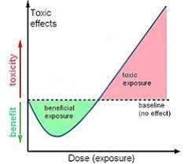
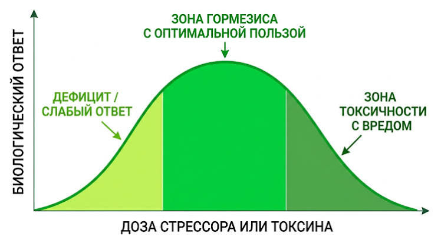
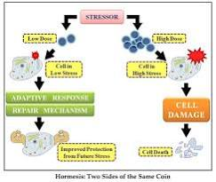

Гормезис (от греч. hórmēsis — быстрое движение, стремление) — это биологический феномен, при котором малые дозы стрессоров или токсинов оказывают стимулирующее и полезное действие на организм. В то же время их высокие дозы вызывают сильное повреждение, токсичность или гибель. [1, 2, 3] 
Суть гормезиса кратко описывает знаменитая фраза Фридриха Ницше: «То, что нас не убивает, делает нас сильнее». Небольшая контролируемая встряска заставляет клетки активировать внутренние механизмы защиты и ремонта, повышая общую выносливость и замедляя старение. [4, 5, 6, 7] 
## 🛠️ Как работает гормезис на клеточном уровне
Когда организм сталкивается с легким раздражителем (фактором гормезиса — горметином), запускается двухфазный дозозависимый ответ: [1, 8] 

   1. Первая фаза (сигнал угрозы): Стрессор вызывает умеренный дефицит энергии или легкий окислительный стресс. [3] 
   2. Вторая фаза (сверхкомпенсация): Клетки включают гены выживания и сигнальные пути (например, белок Nrf2 и сиртуины). Это стимулирует:
   * Аутофагию — очищение клеток от поврежденных белков и «мусора».
      * Митохормезис — обновление и укрепление митохондрий (клеточных электростанций).
      * Синтез антиоксидантов — выработку собственных ферментов защиты (каталаза, глутатион) взамен истощенных.
      * Восстановление ДНК — ускоренный ремонт генетических поломок. [9, 10, 11, 12, 13, 14, 15, 16] 
   

## 🏃 Главные примеры гормезиса в жизни

* Физические нагрузки: Микроразрывы мышечных волокон и окислительный стресс при тренировках стимулируют рост мышц и укрепляют сосуды. [17, 18] 
* Температурный стресс: Кратковременное воздействие холода (закаливание, ледяной душ) или тепла (баня, сауна) активирует защитные белки теплового шока (HSP). [10, 19] 
* Интермиттирующее голодание: Временный недостаток калорий или пищи запускает процессы клеточного омоложения и повышает чувствительность к инсулину. [11, 20] 
* Пищевые горметики (ксеногормезис): Некоторые растения вырабатывают «яды» для защиты от вредителей, но в малых дозах для человека они полезны. К ним относятся капсаицин в остром перце, сульфорафан в брокколи, ресвератрол в винограде и катехины в зеленом чае. [14] 
* Радиационный гормезис: Гипотеза, согласно которой природный фоновый уровень радиации или ультрафиолета стимулирует иммунный ответ и регенерацию клеток. [21, 22] 

## ⚠️ Важное условие: баланс дозы и восстановления
Гормезис работает строго в терапевтическом окне (зоне стимуляции). Если доза стресса окажется слишком высокой, а фаза отдыха и восстановления — недостаточной, полезный эустресс превратится в разрушительный дистресс, ведущий к истощению систем организма и болезням. [14, 23] 

[1] [https://en.wikipedia.org](https://en.wikipedia.org/wiki/Hormesis)
[2] [https://ru.wikipedia.org](https://ru.wikipedia.org/wiki/%D0%93%D0%BE%D1%80%D0%BC%D0%B5%D0%B7%D0%B8%D1%81)
[3] [https://pathogenesis.pro](https://pathogenesis.pro/index.php/pathogenesis/article/view/105)
[4] [https://www.sciencedirect.com](https://www.sciencedirect.com/science/article/pii/S1550413108000028)
[5] [https://uniprof-med.ru](https://uniprof-med.ru/articles/gormezis-i-zhizn)
[6] [https://gazeta.a42.ru](https://gazeta.a42.ru/lenta/news/209539-gerontolog-nazvala-pravila-kotorye-pozvolyat-zit-dolse)
[7] [https://continentalhospitals.com](https://continentalhospitals.com/ru/blog/hormesis-and-gut-health-science-explained/)
[8] [https://m.sobaka.ru](https://m.sobaka.ru/health/psychology/137335)
[9] [https://pmc.ncbi.nlm.nih.gov](https://pmc.ncbi.nlm.nih.gov/articles/PMC2248601/)
[10] [https://www.ambasadaurody.eu](https://www.ambasadaurody.eu/encyclopedia/hormesis)
[11] [https://tinasindwanimd.com](https://tinasindwanimd.com/what-is-hormesis-and-how-can-it-improve-my-health/)
[12] [https://pmc.ncbi.nlm.nih.gov](https://pmc.ncbi.nlm.nih.gov/articles/PMC5354599/)
[13] [https://nv.ua](https://nv.ua/blogs/kak-holodnyy-dush-i-sauna-uluchshayut-rabotu-mozga-chto-takoe-gormezis-obyasnenie-vracha-50624059.html)
[14] [https://growfood.pro](https://growfood.pro/blog/pravilnoe-pitanie/chto-takoe-gormezis/)
[15] [https://www.merriam-webster.com](https://www.merriam-webster.com/medical/hormesis)
[16] [https://www.the-well.com](https://www.the-well.com/editorial/health-coach-tip-all-about-hormesis)
[17] [https://www.ultrahuman.com](https://www.ultrahuman.com/blog/the-biological-concept-of-hormesis/)
[18] [https://pathogenesis.pro](https://pathogenesis.pro/index.php/pathogenesis/article/view/105)
[19] [https://ubiehealth.com](https://ubiehealth.com/doctors-note/hormesis-good-stress-heat-cold-longevity-extend-5721e2)
[20] [https://studfile.net](https://studfile.net/preview/6128153/)
[21] [https://pmc.ncbi.nlm.nih.gov](https://pmc.ncbi.nlm.nih.gov/articles/PMC10604602/)
[22] [https://cyberleninka.ru](https://cyberleninka.ru/article/n/radiatsionnyy-gormezis-blagopriyatny-li-malye-dozy-ioniziruyuschey-radiatsii)
[23] [https://blog.wikium.ru](https://blog.wikium.ru/stress-prinosit-polzu-kak-ispolzovat-gormezis-dlya-dostizheniya-tselej-i-lichnostnogo-rosta.html)
