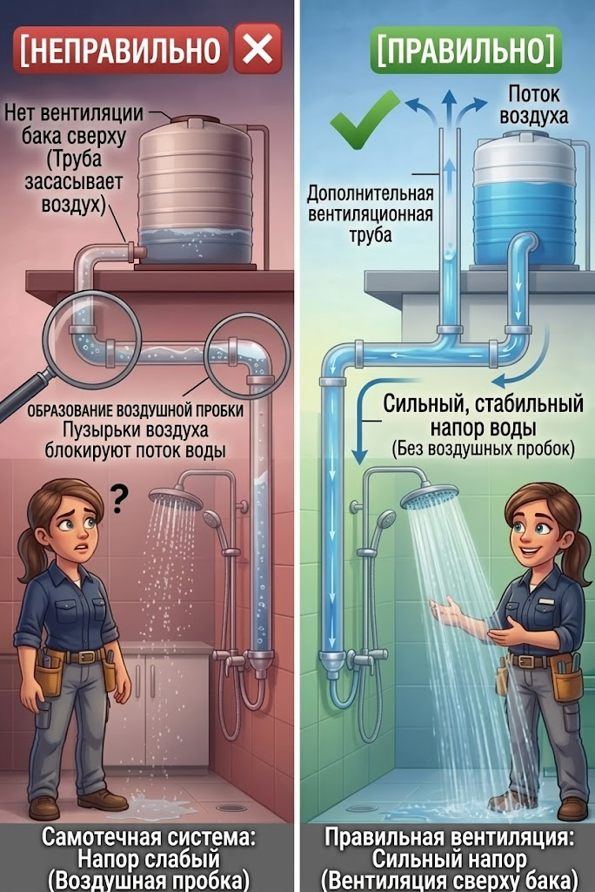
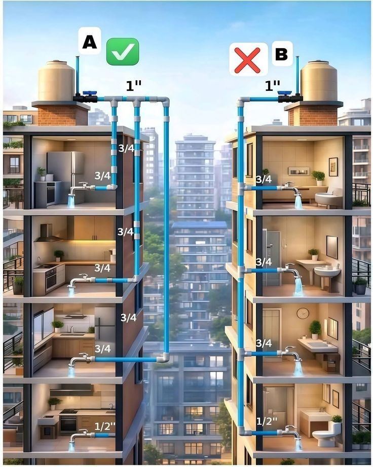
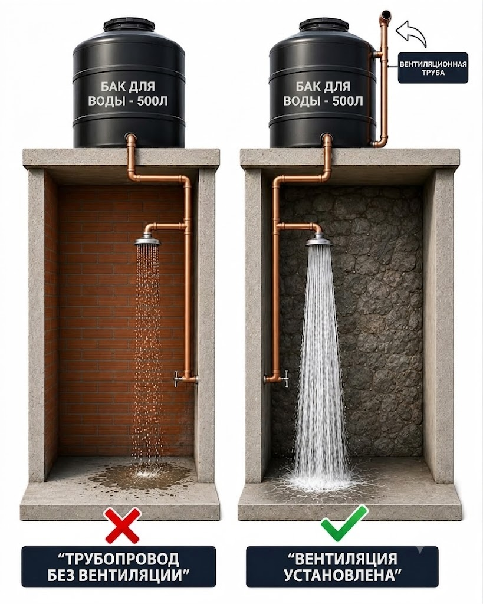
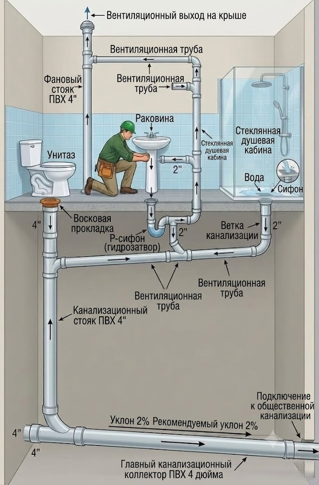

## 1. Проблема левой схемы: Воздушная пробка (Air-Lock)

Ловушка для воздуха: На левой картинке труба имеет неправильную разводку — она сначала опускается, затем поднимается вверх, образуя петлю или «горб» (высокую точку), и только потом идет к душу. В этом изгибе неизбежно скапливается воздух.

Нехватка давления: В самотечной системе давление воды создается исключительно перепадом высот (высотой расположения бака). Этого слабого давления недостаточно, чтобы физически вытолкнуть легкий воздушный пузырь вниз по трубе.

Результат: Воздух работает как упругая пробка. Он сужает сечение трубы или полностью блокирует поток, из-за чего напор падает, и вода из лейки душа течет очень слабо.

## 2. Решение правой схемы: Вентиляционная труба (Vent Pipe)

Свободный выход воздуха: Вертикальная труба (вентиляционный стояк), врезанная в магистраль и выведенная выше максимального уровня воды в баке, решает проблему. Если в систему попадает воздух (например, когда бак опустел и наполняется заново), он просто поднимается по этой трубе вверх и выходит в атмосферу, а не застревает в горизонтальных участках.

Предотвращение вакуума: Когда масса воды падает вниз по трубе к душу, она может создавать разрежение (эффект вакуума) позади себя, что замедляет поток. Это похоже на то, как вода булькает и с трудом выливается из перевернутой пластиковой бутылки. Вентиляционная труба впускает атмосферное давление, позволяя воде вытекать ровной, мощной и непрерывной струей.

Правильная геометрия: Обратите внимание, что на правой картинке также исправлена геометрия основной трубы — убран лишний изгиб вверх, труба идет вниз логичным и прямым путем.

<Giscus />
